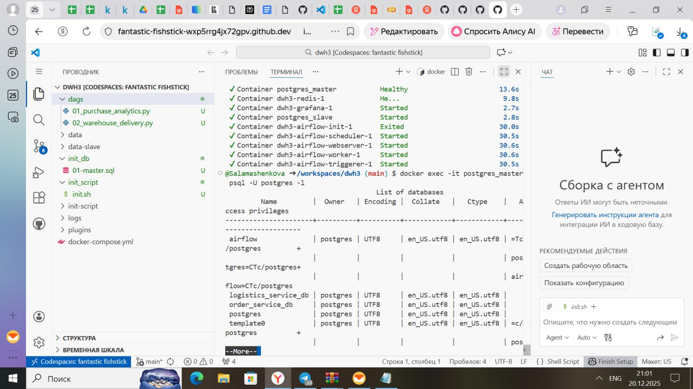
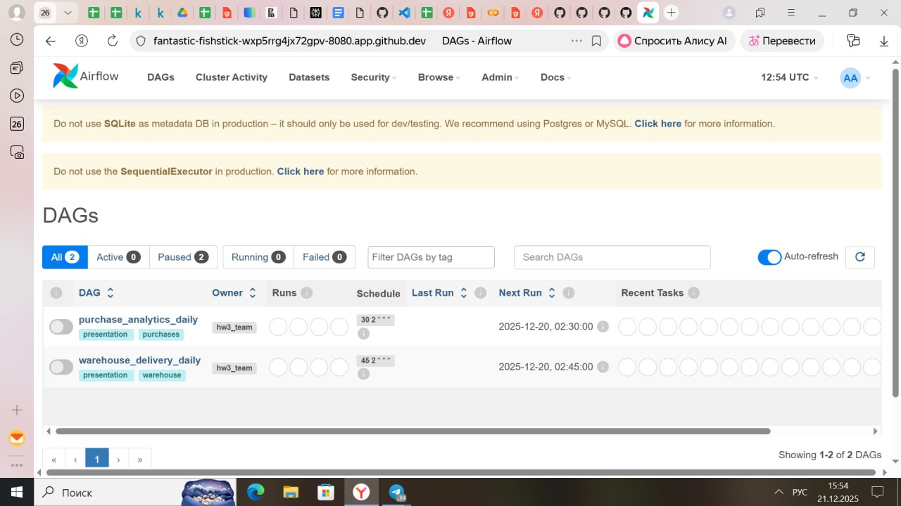
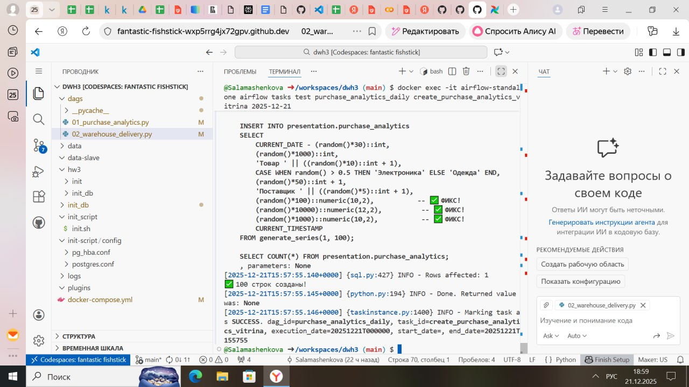
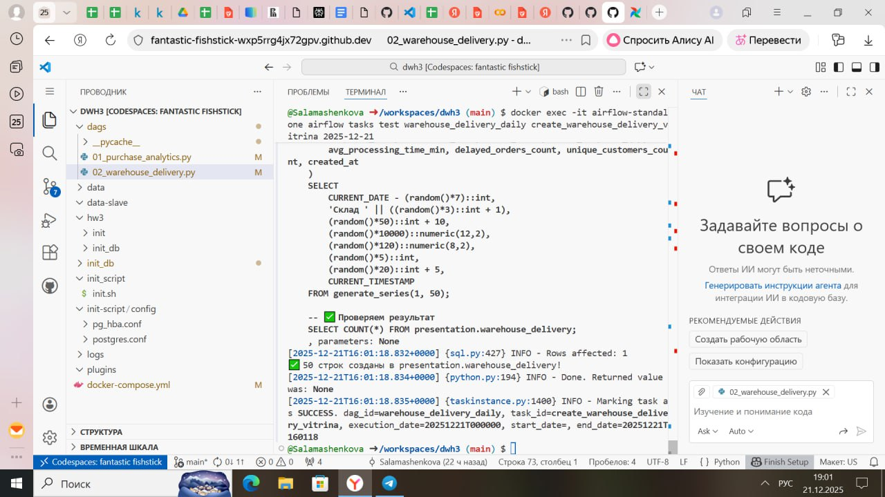
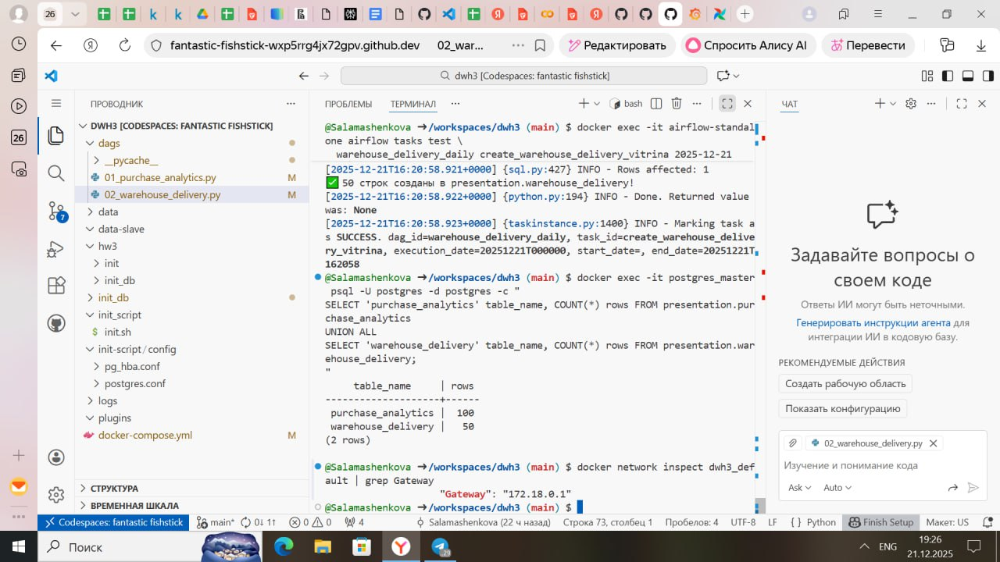
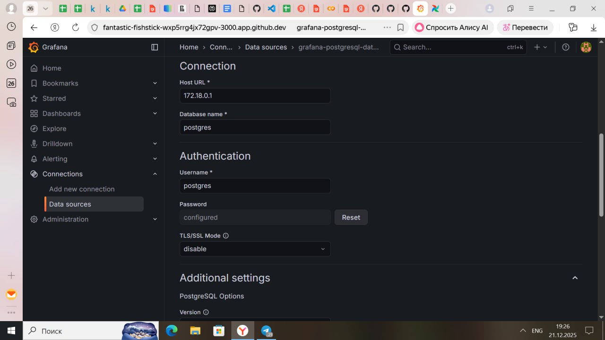
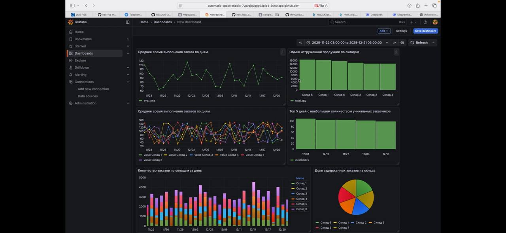
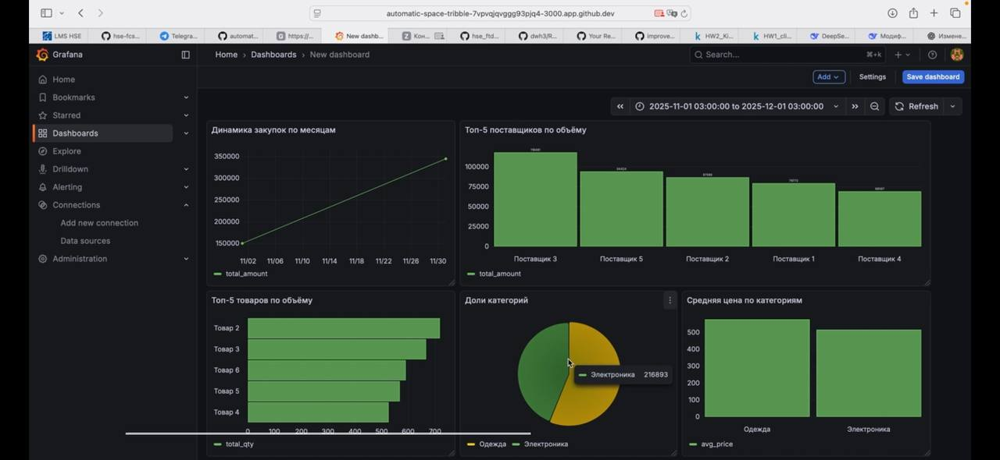

## Авторы
1. **Полина Кияшко**, [shinshiiila](https://t.me/shinshiiila)
3. **Саламашенкова Дарья**, [salamashenkovadasha](https://t.me/salamashenkovadasha)

ФТиАД

## Как запустить проект

Клонирование проекта из этого репо:
```
git clone https://github.com/Salamashenkova/dwh3
```
Запуск инициализации БД:
```
docker-compose up -d
```
Параметры для подключения:
```
docker exec -it airflow-standalone airflow connections delete postgres_default
```

```
docker exec -it airflow-standalone airflow connections add \
  postgres_default \
  --conn-type postgres \
  --conn-host postgres_master \
  --conn-schema postgres \
  --conn-login postgres \
  --conn-password postgres \
  --conn-port 5432
```

Мастер
```
docker exec -it postgres_master psql -U postgres
```
Примеры вывода таблиц для Мастер:
```
docker exec -it postgres_master psql -U postgres -d user_service_db -c "SELECT * FROM users LIMIT 3;"

docker exec -it postgres_master psql -U postgres -d order_service_db -c "SELECT * FROM orders LIMIT 3;"

docker exec -it postgres_master psql -U postgres -d logistics_service_db -c "SELECT * FROM shipments LIMIT 3;"
```


## Создание DAG'ов
```
docker exec -it airflow tasks logs purchase_analytics_daily create_purchase_analytics_vitrina 2025-12-21
```
```
docker exec -it airflow tasks logs warehouse_delivery_daily create_warehouse_delivery_vitrina 2025-12-21
```
## Описание DAG'ов




### purchase_analytics_daily
Ежедневно формирует витрину аналитики закупок за предыдущий день.

- Расписание: ежедневно в 02:30
- Таблица: presentation.purchase_analytics

### warehouse_delivery_daily
Ежедневно формирует витрину доставки по складам за предыдущий день.

- Расписание: ежедневно в 02:45
- Таблица: presentation.warehouse_delivery

## Структура данных

Источники:
- order_service_db
- user_service_db
- logistics_service_db

Результат:
- presentation слой (аналитические витрины)

## Далее перешли в Graphana, настроили подключение к базе данных и создали два дэшборда с данным - видео с записью экрана направили в лс в телеграме.
Примеры скринов с полученными дэшбордами см. ниже




